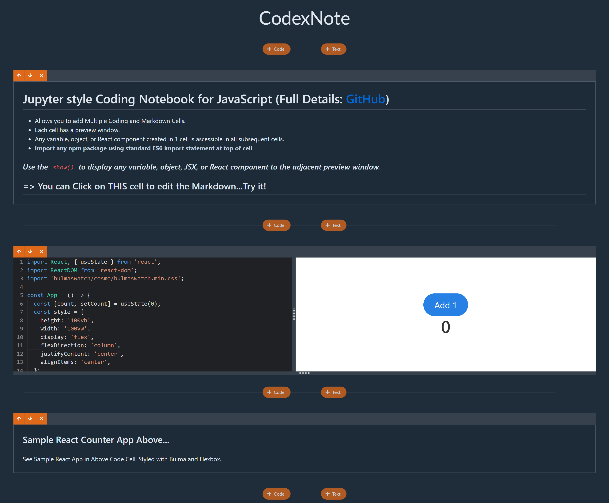

# CodexNote

A Jupyter-style coding notebook for JavaScript. Write markdown notes, execute JavaScript code, and import any npm package using standard ES6 import statements. A perfect playground for JavaScript enthusiasts.



## Features

- **Cumulative Code Execution**: Like a Jupyter Notebook, any variable or function defined in a previous code cell is available in the current code cell.

- **ESBuild and Unpkg**: Uses ESBuild for rapid transpiling and bundling. User can also import almost any npm module with the `import` statement. npm imports are fetched via Unpkg and cached in the browser for performance.

- **Monaco Editor**: Best-in-class editor used in VS Code for inputting and editing code. Comes with syntax error checking, syntax coloring, and IntelliSense. There's also a `Format` button that leverages Prettier to format the code.

- **React MD Editor**: Used for editing markdown notes.

- **Secure Code Execution**: Executes code securely in an iframe using `postMessage`. This ensures that the code does not have direct access to the main app.

- **Custom `show()` Function**: Output variables, objects, JSX, or React components to a preview screen.

## Tech Stack

- React
- Redux

## Getting Started

### Prerequisites

- Ensure you have Node.js installed. Recommended version: `v14`.

### Installation

1. Clone the repository
   ```sh
   git clone https://github.com/patrick-lei-shi/CodexNote.git
   ```

````

2. Navigate to the project directory

   ```sh
   cd CodexNote
   ```

3. Install the dependencies

   ```sh
   npm install
   ```

4. Run the project
   ```sh
   npm start
   ```

## Package Dependencies

- `@fortawesome/fontawesome-free`
- `@monaco-editor/react`
- `@uiw/react-md-editor`
- `axios`
- `bulmaswatch`
- `esbuild-wasm`
- `immer`
- `localforage`
- `monaco-editor`
- `prettier`
- `react`, `react-dom`
- `react-redux`
- `react-resizable`
- `redux`
- `redux-thunk`
- ... and more.

For a full list, see the [package.json](./package.json).

## Scripts

- `npm start`: Runs the app in development mode.
- `npm build`: Builds the app for production.

## Contributing

Pull requests are welcome. For major changes, please open an issue first to discuss what you would like to change.

## License

[MIT](./LICENSE)
````
